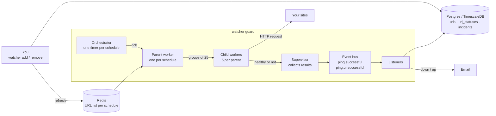

# Watcher

Watcher is an uptime monitor for the command line, written in Go. Give it a URL and an email address. It requests that URL on a fixed schedule, records every result, and emails you once when the site goes down and once when it comes back.

```console
$ watcher add https://example.com get one_minute me@example.com
Connected to PostgreSQL database!
URL successfully added, ID: 1

$ watcher guard
Connected to PostgreSQL database!
Watcher is running

$ watcher analysis 1
Running analysis...
Connected to PostgreSQL database!
URL: https://example.com
HTTP Method: get
Monitoring Frequency: one_minute
Site Status: healthy
Currently Up for: 3h12m4s
Last Checked: 12s ago
Number of Incidents in the last 24 hours: 1
Number of Incidents in the last 7 days: 1
Number of Incidents in the last 30 days: 2
Number of Incidents in the last 365 days: 2
```

> **Status: single process.** Watcher runs as one program with many concurrent workers. Running several copies against the same database is not supported yet.

## How it works



1. **Postgres** is the permanent record: the URLs, every check result, and every outage. Check results live in a TimescaleDB hypertable because there is one row per check, always queried by time.
2. **Redis** holds a copy of the URL list for each schedule, so workers do not query Postgres on every tick. `add` and `remove` refresh it, which is how a running `guard` sees changes without a restart. `guard` refills it from Postgres on start.
3. **The orchestrator** runs one timer per schedule: 10s, 30s, 1m, 5m, 30m, 1h, 12h and 24h.
4. **Workers** do the checking. On each tick a parent worker reads its URL IDs and puts them on a fixed-size queue in groups of 25. Child workers take a group and request each URL with a time limit. A 2xx reply is healthy; anything else, or no reply, is unhealthy. When the queue is full the parent waits, so checks run late instead of memory growing.
5. **The supervisor** collects results and publishes each one on the event bus as `ping.successful` or `ping.unsuccessful`.
6. **Listeners** save the result, then decide what it means:
   - One failed check is not an outage. A counter on the URL goes up by one, and nothing more happens until it reaches `FAILURE_THRESHOLD` failures in a row.
   - At the threshold, an incident is opened and the "DOWN" email is sent.
   - The next success resets the counter, resolves the incident and sends the "UP" email.

### One email per outage

Results are handled concurrently, so two failures for the same URL can arrive at the same instant. Checking for an open incident and then inserting one would let both send an email. Watcher lets the database decide instead:

- **Counting** is one statement, `UPDATE ... SET consecutive_failures = consecutive_failures + 1 ... RETURNING`, so no two results read the same count.
- **Opening** relies on a partial unique index that allows one unresolved incident per URL. Every result runs `INSERT ... ON CONFLICT DO NOTHING`; only the one whose insert created a row sends the email.
- **Resolving** is `UPDATE ... WHERE resolved_at IS NULL`; only the one that closed the incident sends the email.

The tests in `database/` release 24 goroutines at once against a real database and assert that exactly one wins.

Known limit: this guarantees at most one email. If sending fails, the incident is already open and the alert is not retried.

## Quickstart

Requires Go 1.24+, Docker and `make`.

```bash
git clone https://github.com/DevloperAmanSingh/watcher.git && cd watcher
cp .env.example .env
make dev                           # start Postgres, Redis and Mailpit, apply migrations
make build                         # compile to bin/watcher
bin/watcher add https://example.com get ten_seconds me@example.com
bin/watcher guard                  # start monitoring
```

Alert emails land in Mailpit at http://localhost:8025.

## Commands

| Command | What it does |
|---|---|
| `watcher guard` | Starts the monitor. Alias `g`. |
| `watcher add <url> <http_method> <frequency> <contact_email>` | Adds a URL. Method defaults to `get`, frequency to `five_minutes`. Alias `a`. |
| `watcher remove <id>` | Removes a URL and its history. Alias `rm`. |
| `watcher list` | Lists monitored URLs. Flags: `--page`, `--per_page`, `--http_method`, `--frequency`, `--status`. Alias `ls`. |
| `watcher analysis <id>` | Prints current status, time up or down, last check and incident counts. Alias `an`. |

Methods: `get`, `post`, `patch`, `put`, `delete`.
Frequencies: `ten_seconds`, `thirty_seconds`, `one_minute`, `five_minutes`, `thirty_minutes`, `one_hour`, `twelve_hours`, `twenty_four_hours`.

## Configuration

Copy [`.env.example`](.env.example) to `.env`:

```bash
FAILURE_THRESHOLD=3                   # failed checks in a row before a URL is declared down
HTTP_REQUEST_TIMEOUT=5                # seconds allowed per check
MAXIMUM_CHILD_WORKERS=5               # child workers per schedule
MAXIMUM_WORK_POOL_SIZE=25             # URLs per group, and queue size per schedule
SUPERVISOR_POOL_FLUSH_BATCHSIZE=100   # results collected before publishing
SUPERVISOR_POOL_FLUSH_TIMEOUT=5       # or after this many seconds, whichever is first
```

- **Precedence:** process environment variables, then the `.env` file, then defaults.
- **Database:** `DB_USER`, `DB_PASSWORD`, `DB_HOST`, `DB_PORT`, `DB_DATABASE`.
- **Redis:** `REDIS_HOST`, `REDIS_PASS`, `REDIS_DB`.
- **Email:** `MAIL_FROM_ADDRESS`, `MAIL_HOST`, `MAIL_PORT`, `MAIL_USERNAME`, `MAIL_PASSWORD`. Any SMTP server works.

## Development

```bash
make check    # format, vet, lint and test: everything CI runs
make test     # tests with the race detector; needs `make dev` first
make help     # list all targets
```
